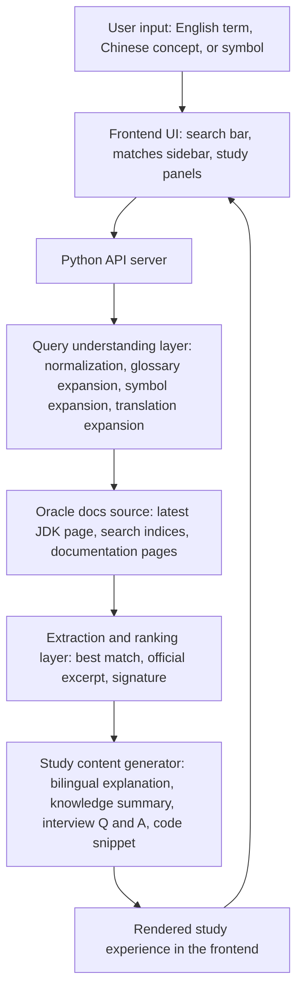

# System Design

## 1. Problem Statement

This project solves a learning and exploration problem for students whose native language is not English and who are still building intuition for Java.

Many learners do not begin with the exact name of a Java API. Instead, they begin with questions such as:

- Can this idea be expressed in Java?
- Which Java concept is closest to what I want to describe?
- If I only know the concept in my own language, how do I find the right official Oracle documentation?
- Once I find one keyword, how do I continue exploring related official content beyond what a textbook briefly mentions?

This project is especially aimed at students who are eager to learn beyond short classroom explanations like “for more, please read Oracle documentation.” They are not satisfied with stopping at a simplified summary. They want a guided path from a natural-language idea, a Chinese concept, or even a symbol such as `%-` or `::`, into the latest Oracle Java documentation.

The motivation is also personal. This project was designed by a student who transitioned from another professional field after spending many years building deep experience there. Entering Java as a new domain, she wanted not only to learn syntax, but to use Java as a language for expressing the ideas, structures, and experiences she had already developed in her previous career. The system is designed to support that kind of curious, concept-driven learning journey.

In short, the system helps learners move from:

- an idea in their own language
- to the closest Java concept
- to the relevant official Oracle documentation
- to a clearer bilingual explanation and example

## 2. Architecture

The system uses a lightweight local architecture with a static frontend and a Python backend.

- `User Input`: The learner enters an English term, a Chinese concept, or a Java-related symbol.
- `Frontend UI`: The page provides the sticky search bar, matched sidebar, and detailed study panels.
- `Python API Server`: The backend serves both the frontend files and the JSON API endpoints.
- `Query Understanding Layer`: The backend expands the user query into Oracle-searchable candidates.
- `Oracle Docs Source`: Oracle is the source of truth for latest version lookup, search indices, and official documentation pages.
- `Extraction + Ranking Layer`: The backend ranks candidate matches and extracts the official excerpt and signature from the chosen page.
- `Study Content Generator`: The backend produces structured learning material around the official result.

At a high level, the architecture has three logical parts:

- frontend presentation layer
- backend search and extraction layer
- Oracle documentation as the authoritative external content source

## 3. Data Flow

The data flows through the system in the following sequence:

1. The frontend loads and requests `/api/config`.
2. The backend fetches or reuses the latest Oracle JDK version and returns the docs base URL.
3. The user enters a query such as `ArrayList`, `左对齐`, `线程池`, or `::`.
4. The frontend sends the query to `/api/search`.
5. The backend normalizes the query by cleaning punctuation and whitespace.
6. The backend expands the query using:
   - manual concept mappings
   - Chinese-to-English replacements
   - symbol hints
   - translation-based English candidates when needed
7. The backend searches Oracle search indices across modules, packages, types, members, and tags.
8. The backend ranks and deduplicates the candidates, then chooses the best result list and top match.
9. The backend fetches the selected Oracle documentation page and extracts:
   - page title
   - signature
   - official excerpt
10. The backend generates study-oriented content:
    - English explanation
    - second-language explanation
    - knowledge summary
    - interview Q&A
    - code snippet
11. The backend returns the result payload to the frontend.
12. The frontend renders the matched sidebar and the detailed content panel.
13. If the user clicks another result, the frontend calls `/api/doc` and reloads the detailed content for that item.

## 4. Key Design Decisions

### Oracle documentation is the source of truth

The system does not replace Oracle documentation with a separate knowledge base. Instead, it guides the learner into the official Oracle source and extracts a useful official excerpt from there. This keeps the app aligned with the latest JDK material.

### Hybrid query understanding instead of one search strategy

The system combines several techniques because no single method is enough for exploratory learning queries:

- direct Oracle index matching for standard API terms
- curated mappings for high-confidence concepts such as `%-`, `::`, and `日期时间`
- Chinese replacement rules for common learning vocabulary
- translation-based expansion for broader multilingual support

This design improves both precision and recall.

### Lightweight local-first architecture

The app is intentionally simple to run: a static frontend plus a Python HTTP server. This reduces setup cost and makes the system easier for students to inspect, modify, and learn from.

### Study output is structured, not just searchable

The goal is not only to retrieve a result but to support understanding. That is why the system generates:

- official excerpt
- bilingual explanation
- knowledge summary
- interview Q&A
- copyable code snippet

This makes the app useful for both discovery and active study.

### Topic-level routing for concept queries

Some user queries do not naturally map to a single class or method. For example, `lambda表达式` and `::` are better treated as concept-entry points than as exact API lookups. The design therefore allows routing to package-level topics such as `java.util.function`.

## 5. Trade-offs

### Chosen: Oracle-backed extraction

What was given up:

- completely offline search
- instant local access to all docs without network dependency

Why:

- the system prioritizes freshness and official accuracy over full offline independence

### Chosen: rule-based plus translation-assisted query expansion

What was given up:

- a fully learned semantic retrieval model
- perfect understanding of every possible Chinese phrasing

Why:

- the current design is much simpler to implement and easier to debug
- it works well for many practical student queries without requiring a large custom model pipeline

### Chosen: local single-server implementation

What was given up:

- distributed scalability
- separate specialized services for search, extraction, and generation

Why:

- this project is currently optimized for clarity, maintainability, and local usability rather than production-scale deployment

### Chosen: generated study assistance around official content

What was given up:

- a purely raw-documentation viewer

Why:

- learners in the exploration stage benefit from scaffolding, not just direct document links

## 6. Scalability

If the data volume or traffic grows, the design can scale in several ways.

### More Oracle content or more search cases

- Persist the fetched Oracle search indices on disk instead of only in memory.
- Add longer-lived cache invalidation keyed by JDK version.
- Precompute query alias dictionaries for common multilingual concepts and symbols.

### More users or more concurrent requests

- Move from the local Python HTTP server to a production web server and application runtime.
- Separate static asset serving from API handling.
- Cache extracted Oracle pages and generated study payloads by URL and language.

### More query complexity

- Introduce a semantic retrieval layer on top of Oracle index search.
- Add embeddings or a concept graph for multilingual educational queries.
- Group search results by topic, package, type, and member to avoid noisy result ranking.

### More languages

- Expand the second-language explanation pipeline beyond the current set.
- Add language-specific glossary packs rather than relying only on direct translation.

In its current form, the system scales well enough for a local learning tool, but not yet for a large multi-user hosted platform.

## 7. Limitations

The current design still has several important limitations.

- Query understanding is improved, but not complete. Some Chinese and symbol-based searches still depend on handcrafted mappings.
- Oracle page structure may change, which can break HTML extraction rules.
- Member-level results can still be noisy compared with concept-level learning intent.
- The app does not yet maintain search history, bookmarks, or personalized learning paths.
- The current study content is generated around the official page, but it is not a full curriculum planner.
- The system depends on network access to Oracle content and related live lookups.
- The architecture is currently best suited for local or low-scale use rather than a high-traffic hosted product.

Even with these limitations, the system already provides a strong bridge between exploratory student questions and official Java documentation, which is the core problem it was built to solve.
